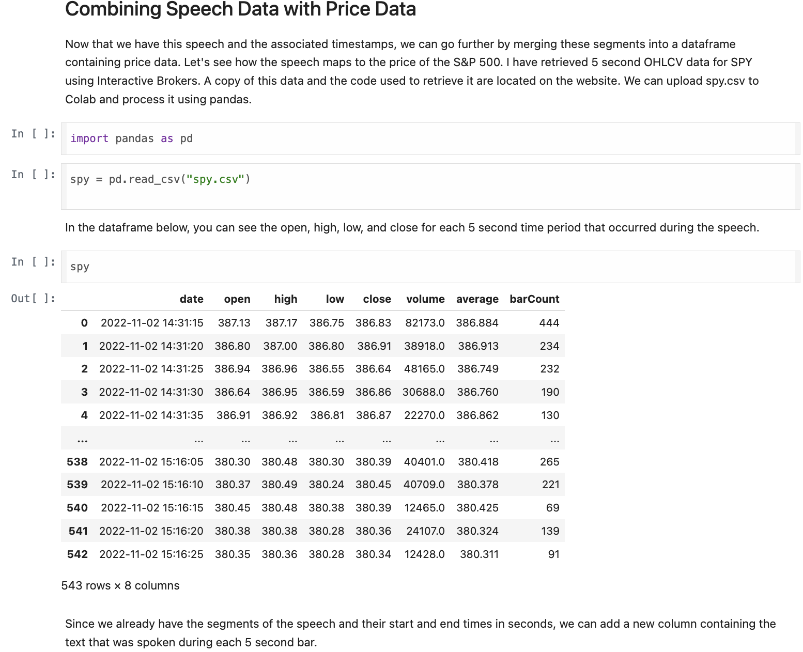
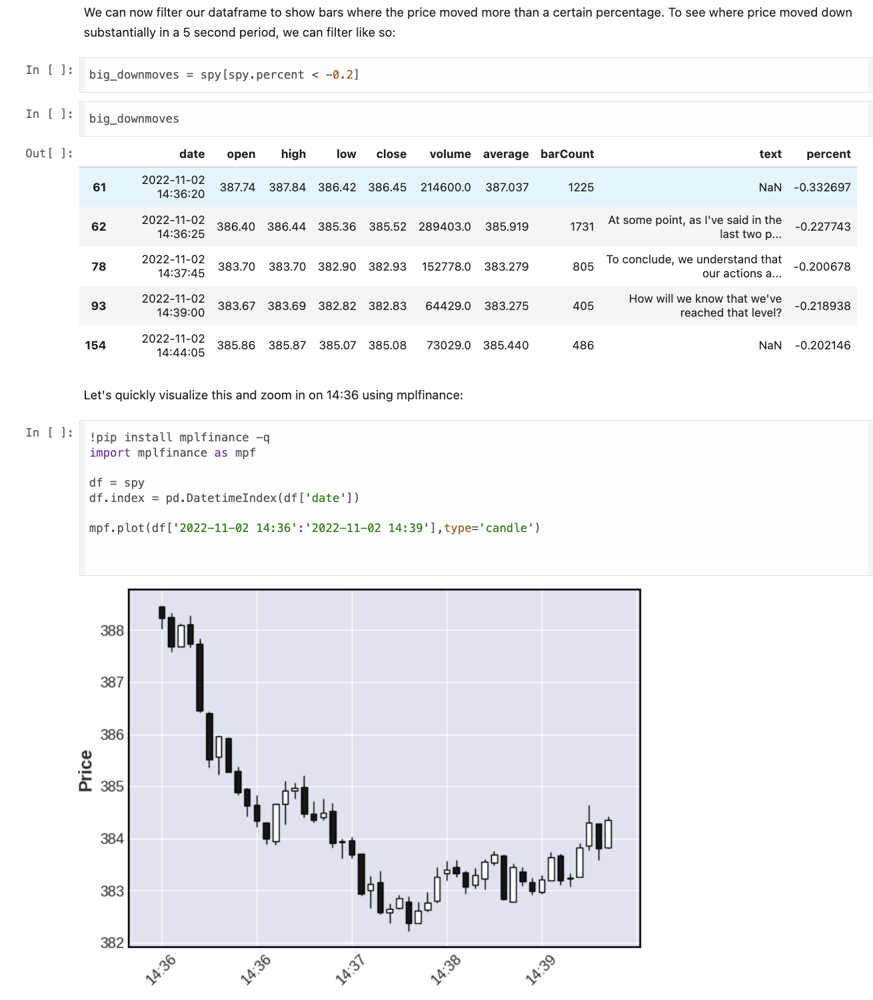

# Speech-to-Text Market Analysis

Analyze market movements by correlating speech transcripts with real-time price data using OpenAI's Whisper model.

## Overview

This Jupyter notebook transcribes audio from the FED meeting and maps the transcript to market data to identify which spoken phrases correspond to significant price movements.

## Quick Start
- import whisper
- from pytube import YouTube
- import pandas as pd

# Load model
model = whisper.load_model('base')

# Download and transcribe
```
youtube_video = YouTube(youtube_video_url)
stream = youtube_video.streams.filter(only_audio=True).first()
stream.download(filename='audio.mp4')
output = model.transcribe('audio.mp4')
```

# Merge with price data
```
spy = pd.read_csv("spy.csv")
for segment in output['segments']:
    second = int(segment['start'])
    second = second - (second % 5)
    spy.loc[second // 5, 'text'] = segment['text']
```

# Examples


